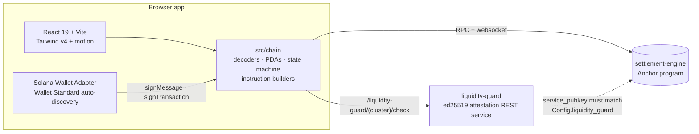
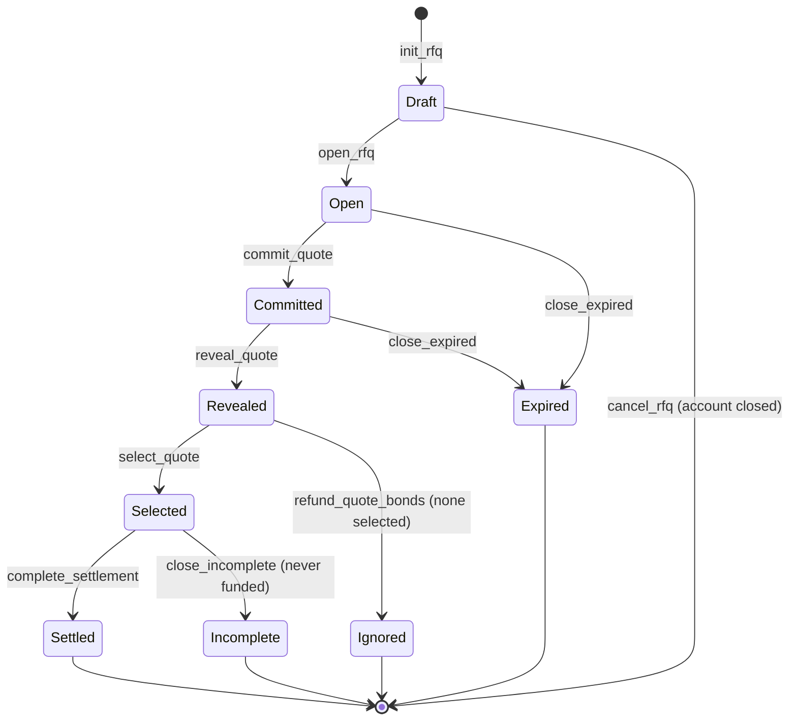

# UnleakTrade — App

Frontend for **UnleakTrade**, a confidential OTC / RFQ trading d-app on Solana.
This is the app at [app.unleak.trade](https://app.unleak.trade); the marketing
site ([unleak.trade](https://unleak.trade)) lives in the sibling
`landing-page` repo.

Trades follow a **commit–reveal RFQ protocol**: a poster publishes a request
for quote, counterparties commit _sealed_ quotes (a SHA-256 commitment backed
by a USDC bond and an ed25519 liquidity attestation), reveal them after the
commit window closes, the poster selects a winner, and the winner funds the
settlement. Quotes stay confidential until reveal — nobody can front-run a
number they cannot see.

The frontend is a pure consumer of on-chain state: React reads/decodes program
accounts over RPC + websocket subscriptions and submits the program's
instructions from the connected wallet. There is no backend of our own; the
only service dependency is the liquidity-guard attestation microservice.

## Architecture



- **`src/chain/`** — everything on-chain: zod-validated decoders for all 8
  program accounts, PDA derivation, deadline math and instruction guards
  ported 1:1 from the Rust (`state-machine.ts`), fee math (`math.ts`), one
  transaction builder per instruction (`instructions/`), and the
  liquidity-guard client. Reads go through TanStack Query with websocket
  account subscriptions — no polling.
- **`src/app/`** — the UI: routes, providers (cluster → connection → wallet →
  query → auth), screens, and shared primitives.
- **Program id** (devnet + localnet):
  `7wrjbU1NbVtUCUGP1obi3aiT6QrjXZnH5XJDXMsKtkPG`.
- **Commit-hash preimage** (178 bytes:
  `salt[64] ‖ rfq[32] ‖ taker[32] ‖ quote_mint[32] ‖ quote_amount_LE[8] ‖ bond_amount_LE[8] ‖ taker_fee_bps_LE[2]`)
  is byte-identical across three repos — the program verifies it, the
  liquidity-guard signs it, and `src/chain/commitHash.ts` preflights it.

## RFQ lifecycle (9 states)



The Rust in `../settlement-engine` is the authoritative spec; the frontend
mirrors every state guard in `src/chain/state-machine.ts`, with unit tests
asserting decoder ↔ IDL parity.

## Quickstart — devnet (default)

Requires Node ≥ 22.

```bash
git clone <this repo> && cd app
npm install
npm run dev        # → http://localhost:3000
```

That's it — zero configuration. The committed IDL supplies the program id,
devnet USDC is the default mint, and the dev proxy routes
`/liquidity-guard/devnet/*` to the hosted attestation service. Connect any
Wallet Standard wallet (Phantom, Solflare, Backpack, …) and sign the
`signMessage` challenge.

## Quickstart — localnet

Needs the sibling repos checked out next to this one (`../settlement-engine`,
`../liquidity-guard`).

```bash
bash scripts/dev-localnet.sh    # anchor localnet + program deploy
npm run copy-idl                # refresh src/chain/idl/ after anchor build
# run liquidity-guard on :8080 (see its README)
npm run seed                    # seed RFQs in every lifecycle state
npm run dev                     # switch the navbar cluster picker to Localnet
```

## Environment variables

All optional — `.env.example` documents every knob. Values fall back to
baked-in defaults unless overridden.

| Variable                                 | Purpose                                                                                                          |
| ---------------------------------------- | ---------------------------------------------------------------------------------------------------------------- |
| `VITE_SOLANA_CLUSTER`                    | Default cluster (`devnet`)                                                                                       |
| `VITE_RPC_URL_{DEVNET,MAINNET,LOCALNET}` | RPC endpoint overrides                                                                                           |
| `VITE_SETTLEMENT_PROGRAM_ID`             | Override the committed IDL's program id                                                                          |
| `VITE_USDC_MINT`                         | Override the bond mint (devnet USDC default)                                                                     |
| `VITE_LG_URL_{LOCALNET,DEVNET,MAINNET}`  | liquidity-guard upstreams, consumed **only** by the Vite dev proxy                                               |
| `DEV_WALLET_KEYPAIR_DIR`                 | Dev-only: folder of Solana CLI keypairs registered as in-browser test wallets (dev server only, never in builds) |

Note: the attestation service's ed25519 pubkey is deliberately **not** an env
var — the on-chain `Config.liquidity_guard` field is the source of truth, and
the dev-only `HealthPill` surfaces any drift.

## Scripts

| Command                                    | What it does                                                                            |
| ------------------------------------------ | --------------------------------------------------------------------------------------- |
| `npm run dev`                              | Vite dev server on :3000                                                                |
| `npm run build`                            | Production build → `build/` (transpile only — **does not type-check**)                  |
| `npm run typecheck`                        | `tsc --noEmit` — the real type signal                                                   |
| `npm run lint` / `format` / `format:check` | ESLint (flat config) / Prettier                                                         |
| `npm test` / `test:watch`                  | Vitest — decoders, state-machine guards, fee/deadline math, PDAs, market stats, rewards |
| `npm run test:e2e` / `test:e2e:report`     | Playwright end-to-end suite / open the last report                                      |
| `npm run copy-idl`                         | Refresh `src/chain/idl/` from `../settlement-engine/target`                             |
| `npm run seed`                             | Append devnet/localnet fixtures across all 9 states                                     |

## Testing

- **Unit** (`src/chain/__tests__/`, `src/app/lib/__tests__/`): pure-logic
  suites; fixtures round-trip through the committed IDL's Borsh coder, so
  decoder ↔ IDL parity is proven without a validator.
- **End-to-end** (`e2e/`): Playwright drives the real app against live devnet
  using **dev-only keypair-backed wallets** (`src/dev/devWallet.ts`) — no
  browser extension needed. Three projects: `desktop` + `mobile` (read-only,
  run on every PR) and `tx` (the full lifecycle including the reward claim —
  runs on `workflow_dispatch` or a `[full-e2e]` commit). `[skip-e2e]` in a
  commit message bypasses the PR job. See [`e2e/README.md`](e2e/README.md).

## Dev tooling

- **`/dev/stories`** — component gallery (no auth required): state pipeline,
  deadline ring, bond breakdown, responsive modal, rewards section, the RFQ
  wizard, and more.
- **`/dashboard?debug=1`** — decoded on-chain `Config` panel.
- **`HealthPill`** — liquidity-guard health + pubkey-drift indicator (dev
  builds only).
- **Dev wallets** — point `DEV_WALLET_KEYPAIR_DIR` at a folder of _devnet_
  keypairs and each appears in the wallet picker as `Dev: <name>`, signing
  locally. Never point this at mainnet keys.

## Design

The UI is **role-free**: the words maker/taker/facilitator never appear in
user-facing copy. A wallet's relation to an RFQ (posted it? owns a quote on
it? is its reward recipient?) is derived from on-chain state and used only to
decide which actions are legal — one action bar, one activity view, no role
switchers. Rewards and fees are always denominated in the RFQ's quote token,
never aggregated into USD.

Visual source of truth: the
[Figma design file](https://www.figma.com/design/vmyQPE8WnUX4a5JEl6C2BA)
(issue #21).

## Companion repositories

| Repo                   | Role                                                                                                |
| ---------------------- | --------------------------------------------------------------------------------------------------- |
| `../settlement-engine` | Anchor program — account layouts, instruction guards, fee math. **The Rust wins on any ambiguity.** |
| `../liquidity-guard`   | ed25519 attestation microservice gating `commit_quote` (`/health`, `/check`)                        |

## Deployment

- **Production** — GitHub Pages via `.github/workflows/deploy.yml` on push to
  `main` (SPA fallback + CNAME for `app.unleak.trade`).
- **PR previews** — Vercel via `.github/workflows/preview.yml` (internal PRs
  only).
- **CI** — typecheck + lint + unit tests + read-only e2e on every PR
  (`ci.yml`); full transaction e2e on demand (`e2e.yml`).
